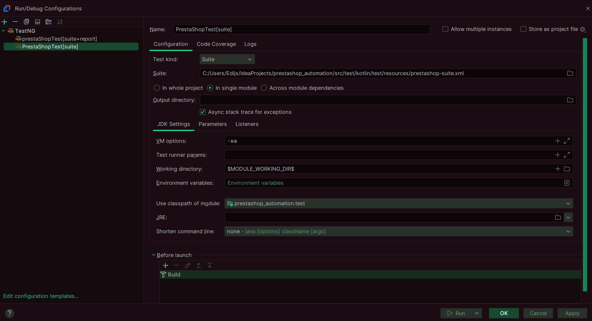

# PrestaShop Automation Project

## This project automates testing on demo.prestashop.com using **Kotlin, Selenium, and Gradle.**

## To Run from IDE (IntelliJ):
- Right-click prestashop-suite.xml in src/test/kotlin/test/resources > Run '....[prestashop_automation.test]'.
- Or create new TestNG configuration > Run. Example below.
- If you wish to get emailable report then on TestNG creation head to listeners section and search for EmailableReporter2 - add it.
  
## To Run from Command Line (PowerShell or Terminal):
### PowerShell:
- Navigate to the project folder: cd C:\Users\YourUsername\Downloads\prestashop_automation or any other folder where you saved it.
- For a full/initial test run: ./gradlew test
- For repeated runs: ./gradlew test --tests PrestaShopTest
### Terminal:
- For a full/initial test run: ./gradlew test
- For repeated runs: ./gradlew test --tests PrestaShopTest

## Dependencies
- See build.gradle.kts

## Suite
- See prestashop-suite.xml in src/test/kotlin/test/resources
### Personal notes
While working on this project, I got a bit carried away and implemented some unnecessary bonus features. Mostly because I have never used Kotlin before.  
I was learning the language on the fly while juggling Kotlin docs and homework while also really enjoying the no reload entire page - SPA :trollface:  
Because of this experience I can definitely say that Kotlin > java 🤩
