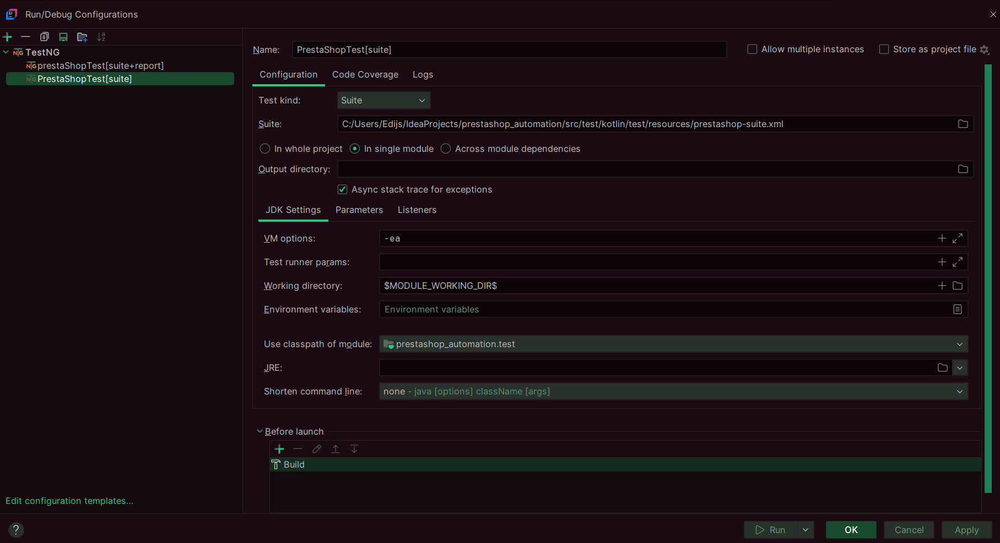

# PrestaShop Automation Project

Automated UI tests for the [PrestaShop demo store](https://demo.prestashop.com/).

Built with **Kotlin**, **Selenium WebDriver**, **TestNG**, and **Gradle**.

## Technologies Used
- **Kotlin** – Main programming language
- **Selenium WebDriver** – Browser automation
- **TestNG** – Test framework
- **Gradle** – Build tool

## 📁 Project Structure

````bash
prestashop-automation/
├── src/test/kotlin/           # Test source code
├── assets/                    # Screenshots and other assets
├── gradle/wrapper/            # Gradle wrapper
├── build.gradle.kts           # Dependencies and configuration
├── prestashop-suite.xml       # TestNG test suite
├── gradlew & gradlew.bat      # Gradle executables
└── README.md
````

## To Run from IDE (IntelliJ):
- Right-click prestashop-suite.xml in src/test/kotlin/test/resources > Run '....[prestashop_automation.test]'.
- Or create new TestNG configuration > Run. Example below.
- If you wish to get emailable report then on TestNG creation head to listeners section and search for EmailableReporter2 - add it.
  
## To Run from Command Line (PowerShell or Terminal):
### PowerShell:
- Navigate to the project folder: cd C:\Users\YourUsername\Downloads\prestashop_automation or any other folder where you saved it.
- For a full/initial test run: ./gradlew test
- For repeated runs: ./gradlew test --tests PrestaShopTest
### Terminal:
- For a full/initial test run: ./gradlew test
- For repeated runs: ./gradlew test --tests PrestaShopTest

## About the Project
This project was created while I was learning Kotlin. I implemented automated tests for key flows on the PrestaShop demo website.
During development I experimented with various approaches as I was learning the language on the fly.

## Status
Currently a personal learning / portfolio project
Focused on UI automation with Selenium
